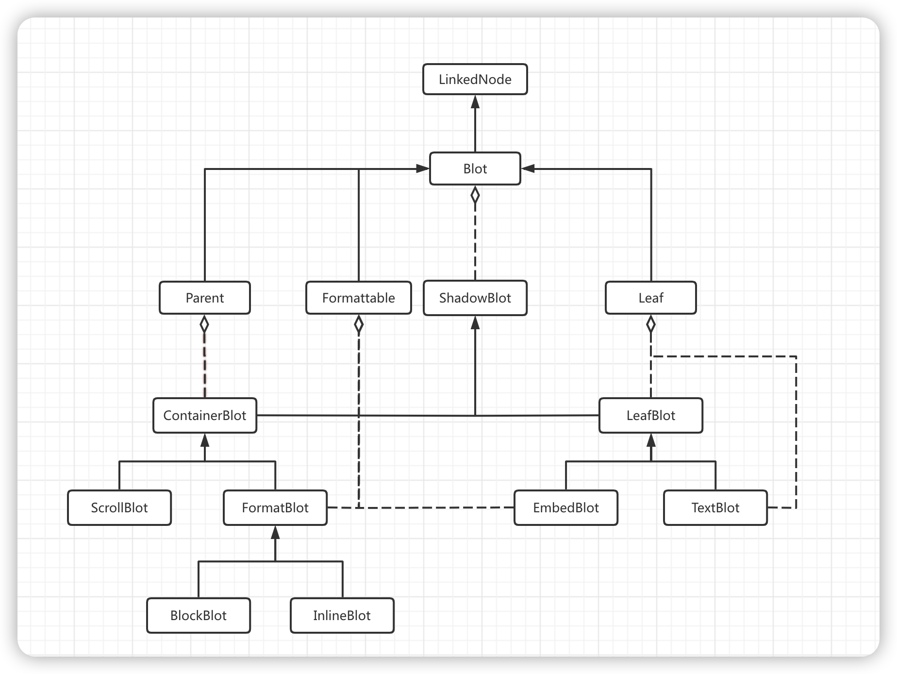
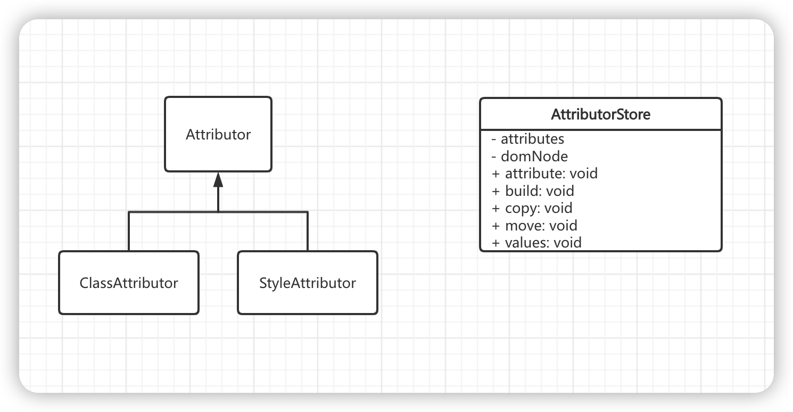

# Parchment源码分析

Parchment是一种文档模型，是与DOM树并行的树结构。`Blots`构成`Parchment` 树的节点，`Attributors` 修饰节点格式。

#### Blot类图

##### 节点用途

+ Blot：核心接口，申明了节点公用的属性和方法

+ Parent：父类节点接口，增加申明了对子节点的操作方法

+ Formattable：可格式化节点接口，增加申明了格式化的方法

+ Leaf：叶子节点的接口，增加申明了叶子节点的特有的方法

+ ShadowBlot：节点核心实现类，所有Blot的实现类都需要继承该类

+ ContainerBlot：容器型节点的基类

+ ScrollBolt：Parchment文档的根节点

+ FormatBlot：格式化节点

+ BlockBlot：块节点

+ InlineBlot：行内节点

+ LeafBlot：叶子节点，无子节点

+ EmbedBlot：嵌入式节点，可格式化，无子节点，一般用来表示Dom的空节点，当然也可以表示正常的节点

+ TextBlot：文字节点，无子节点

#### Attribute类图

#### Registry

+ register: 将进行注册的`Blot` 或者 `Attribute` 分类归集到`attributes` `classes` `tags` `types` 集合中，为`Register.query`查找提供数据源

+ query:  查找原先注册的`Blot`或者`Attribute`

+ find: 通过`domNode`查找对应的`Blot`

+ create: 创建一个之前注册过的`Blot`，会调用`Blot(ShadowBlot)`定义的create方法
